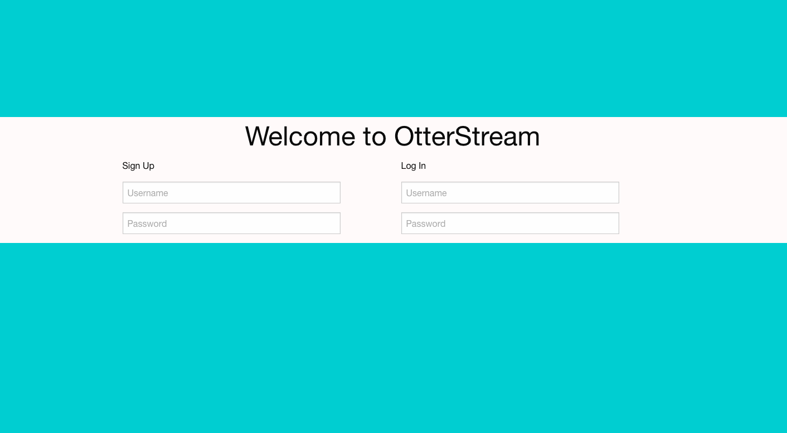

## OtterStream

### Description:
OtterStream is a social network.
It allows users to chat, share projects, and post about anything at all.

### User Stories:

A user has the ability to create an account, and use the established username and password to log into the account.
Upon successful log in, a user is prompted to fill out a form, which gives them the ability to share the information they wish. Including links to their other social network and github profiles.

A user has the ability to participate in a global chat about anything at all.

A user may choose to upload a photo of themselves, and or a screen shot of a project they wish to share with other users.
In addition to a screenshot, a user can also include a description of the project they are sharing.

A user can use any of the links on their profile page, which will allow the user to access any feature on the site - without having to navigate away from their profile.

### URL:

https://otterstream.herokuapp.com/

### Technologies:
* NODE JS
* EXPRESS
* MONGO
* JavaScript/jQuery
* Foundation

### Credits:

* https://github.com/aleksa000777
* https://github.com/soitbros
* https://github.com/Cmaack
